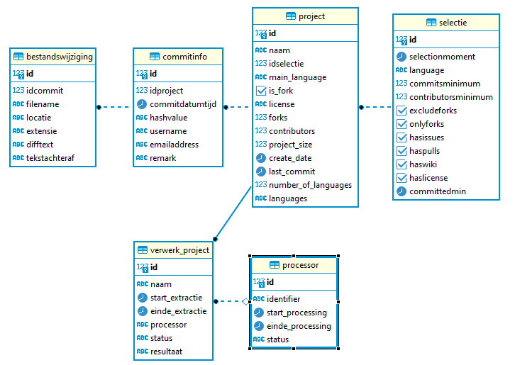

# Database description

Our database has two functional and one technical part.

* tables containing the information on projects.
* tables containing the configuration and results of our analysis
* tables to control and monitor the process.

### tables containing the information on projects
We store information about the following entities:

#### Selectie
In the selectie table we store data about the selection we make, at which date and with which criteria.
This table stores the metadata for the reason why projects are selected.  

#### Project
The project table contains information about projects which are registered on GitHub. This data is valid at the moment of selection. If there is a gap between the moment of selection and the processing of the project, there might be a discrepancy. 
For instance, in the metadata the number of forks is noted. However, somebody might have made a new fork in the meantime. 
Each project references a selection, which indicates why the project is selected.

#### Commitinfo
The commitinfo table contains the metadat about git commits. 
When, by whom, comments, are all stored. 
Commitinfo relates to project.

#### Bestandswijziging
The bestandswijziging table contains information about filechanges. It contains the name of the file, the diff, the text after the change.
Bestandswijziging relates to commitinfo. 

### tables containing the analysis

### tables to control and monitor the process
This is the technical part of the database.

To keep the data about the projects we process separate from the data about the proccing itself some extra tables have been added.
To be able to do parallel processing we have to administrate which processes are running,
and to be able to assign the correct work for those processes. 
Processes register and deregister themselves (by calling procedures), this information in the 'processor' table.
For each process, the state is kept the 'verwerk_project' table. The content is modified by calling procedures. 
The procedures garantee that each project is only processed once, and that each project gets processed. 