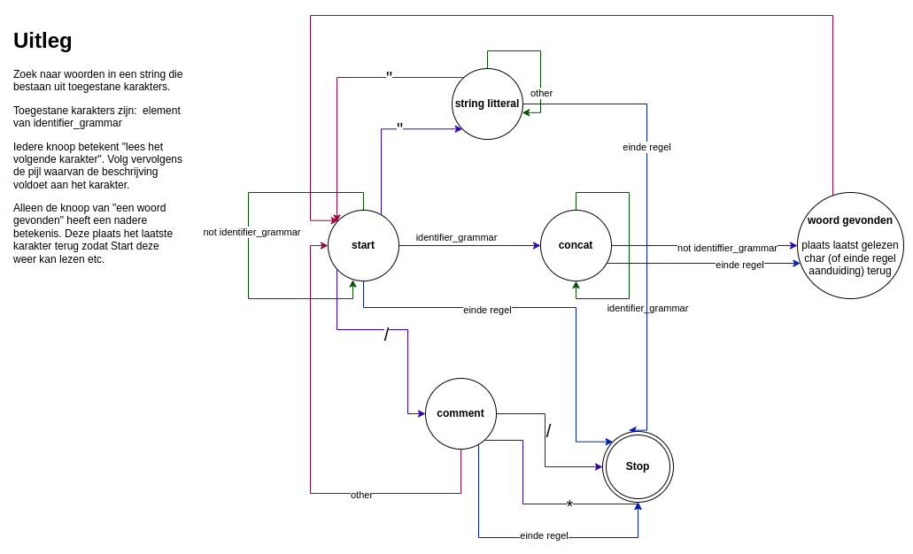

Huidige schema analyse van een regel tekst.

Zal later worden uitgebreid met een specifieke  analyse van Elixir code.

Uiteindelijk wil ik voldoen aan de theorie van formele talen en automaten.

Deze analyse is een eerste stap in die richting.

